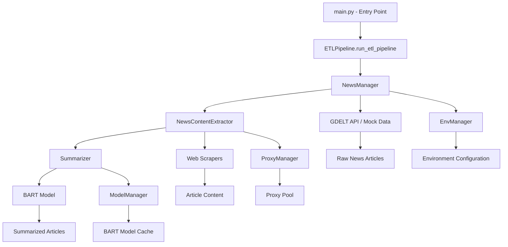

# MASX AI News ETL Pipeline - Flow Diagram

## Overview
The MASX AI News ETL pipeline is a comprehensive system that extracts, processes, and summarizes news articles from the GDELT API using advanced AI/ML techniques. The system operates in both standalone debug mode and production Airflow DAG mode.

## High-Level Architecture Flow



## Detailed Component Flow

### 1. Entry Point (`main.py`)
```
┌─────────────────────────────────────────────────────────────┐
│                    Application Entry                        │
├─────────────────────────────────────────────────────────────┤
│ • Entry point: main.py                                     │
│ • Calls: ETLPipeline.run_etl_pipeline()                    │
│ • Mode: Standalone execution                               │
│ • Error handling: Try-catch with timing                    │
└─────────────────────────────────────────────────────────────┘
```

### 2. ETL Pipeline Orchestrator (`etl_pipeline.py`)
```
┌─────────────────────────────────────────────────────────────┐
│                    ETLPipeline Class                        │
├─────────────────────────────────────────────────────────────┤
│ Input: None                                                 │
│ Process:                                                    │
│ • Sequential task execution                                 │
│ • Performance timing                                        │
│ • Error handling and logging                                │
│ • Debug mode support                                        │
│ Output: Processed articles with summaries                   │
└─────────────────────────────────────────────────────────────┘
```

### 3. Task 1: News Manager (`news_manager.py`)
```
┌─────────────────────────────────────────────────────────────┐
│                    NewsManager Task                         │
├─────────────────────────────────────────────────────────────┤
│ Input: Environment configuration                            │
│ Process:                                                    │
│ • Load environment variables via EnvManager                 │
│ • Query GDELT API for recent news articles                 │
│ • Fallback to mock data in debug mode                      │
│ • Validate articles using Pydantic schemas                 │
│ • Map to NewsArticle schema format                         │
│ Output: List of validated NewsArticle objects               │
└─────────────────────────────────────────────────────────────┘
```

### 4. Task 2: Content Extraction (`news_content_extractor.py`)
```
┌─────────────────────────────────────────────────────────────┐
│                NewsContentExtractor Task                    │
├─────────────────────────────────────────────────────────────┤
│ Input: NewsArticle objects from NewsManager                │
│ Process:                                                    │
│ • Initialize proxy manager for web scraping                │
│ • Use ThreadPoolExecutor for parallel processing           │
│ • For each article URL:                                     │
│   ├─ Try BeautifulSoup extraction first                    │
│   ├─ Fallback to Crawl4AI if needed                        │
│   └─ Validate extracted content quality                    │
│ • Proxy rotation for load balancing                        │
│ Output: Articles with raw text content                     │
└─────────────────────────────────────────────────────────────┘
```

### 5. Task 3: Article Summarization (`summarizer.py`)
```
┌─────────────────────────────────────────────────────────────┐
│                    Summarizer Task                          │
├─────────────────────────────────────────────────────────────┤
│ Input: Articles with raw text content                      │
│ Process:                                                    │
│ • For each article:                                         │
│   ├─ Translate non-English content to English              │
│   ├─ Check if text fits BART model limits                  │
│   ├─ Compress using TF-IDF if needed                       │
│   └─ Generate summary using BART model                     │
│ • Optional: Generate questions from summaries              │
│ Output: Articles with summaries and questions              │
└─────────────────────────────────────────────────────────────┘
```

## Component Details

### Singleton Managers

#### Environment Manager (`env_manager.py`)
```
┌─────────────────────────────────────────────────────────────┐
│                    EnvManager                               │
├─────────────────────────────────────────────────────────────┤
│ • Singleton pattern for environment variables              │
│ • Loads configuration from .env file                       │
│ • Provides centralized access to:                          │
│   ├─ API keys and URLs                                     │
│   ├─ Processing parameters                                 │
│   ├─ Debug mode settings                                   │
│   └─ Proxy configuration                                   │
└─────────────────────────────────────────────────────────────┘
```

#### Proxy Manager (`proxy_manager.py`)
```
┌─────────────────────────────────────────────────────────────┐
│                    ProxyManager                             │
├─────────────────────────────────────────────────────────────┤
│ • Proxy Discovery:                                          │
│   ├─ Scrapes proxy lists from web sources                  │
│   ├─ Validates proxy functionality                          │
│   └─ Maintains proxy pool with expiration                  │
│                                                             │
│ • Proxy Testing:                                            │
│   ├─ Concurrent testing using ThreadPoolExecutor           │
│   ├─ Timeout-based validation                              │
│   └─ Rotates proxies for load balancing                    │
└─────────────────────────────────────────────────────────────┘
```

#### Model Manager (`model_manager.py`)
```
┌─────────────────────────────────────────────────────────────┐
│                    ModelManager                             │
├─────────────────────────────────────────────────────────────┤
│ • BART Model Management:                                    │
│   ├─ Lazy loading of facebook/bart-large-cnn               │
│   ├─ GPU/CPU device detection                              │
│   ├─ Model caching and reuse                               │
│   └─ Tokenizer configuration                               │
│                                                             │
│ • Model Configuration:                                      │
│   ├─ Max token limits                                       │
│   ├─ Device optimization                                    │
│   └─ Memory management                                      │
└─────────────────────────────────────────────────────────────┘
```

### Web Scraping Layer
```
┌─────────────────────────────────────────────────────────────┐
│                    Web Scrapers                             │
├─────────────────────────────────────────────────────────────┤
│ • BeautifulSoupExtractor: Primary scraping method          │
│   ├─ Uses requests with proxy rotation                     │
│   ├─ HTML parsing and text extraction                      │
│   ├─ Fast and lightweight                                  │
│   └─ Content validation (>100 chars)                       │
│                                                             │
│ • Crawl4AIExtractor: Fallback method                       │
│   ├─ Advanced web crawling with AI                         │
│   ├─ Handles JavaScript-heavy sites                        │
│   ├─ Markdown generation with content filtering            │
│   └─ Async processing support                              │
│                                                             │
│ • WebScraperUtils: Common utilities                        │
│   ├─ Text cleaning and normalization                       │
│   ├─ Link and image removal                                │
│   └─ UI element filtering                                  │
└─────────────────────────────────────────────────────────────┘
```

### AI/ML Processing
```
┌─────────────────────────────────────────────────────────────┐
│                    NLPBart Model                            │
├─────────────────────────────────────────────────────────────┤
│ • Model: facebook/bart-large-cnn                           │
│ • Features:                                                 │
│   ├─ Text summarization with BART                          │
│   ├─ TF-IDF compression for long texts                     │
│   ├─ NLTK sentence tokenization                            │
│   └─ GPU acceleration support                              │
│                                                             │
│ • Processing Pipeline:                                      │
│   ├─ Text suitability check                                │
│   ├─ TF-IDF compression if needed                          │
│   ├─ BART summarization                                    │
│   └─ Summary post-processing                               │
│                                                             │
│ • Question Generation:                                      │
│   ├─ Flan-T5-Large model                                   │
│   ├─ Up to 3 questions per summary                         │
│   └─ Temperature-controlled generation                     │
└─────────────────────────────────────────────────────────────┘
```

### Translation Layer
```
┌─────────────────────────────────────────────────────────────┐
│                    Translator                               │
├─────────────────────────────────────────────────────────────┤
│ • Service: Google Translate API                             │
│ • Features:                                                 │
│   ├─ Multi-language detection                              │
│   ├─ English translation for non-English content           │
│   ├─ Text normalization and cleaning                       │
│   └─ Unicode handling                                      │
└─────────────────────────────────────────────────────────────┘
```

## Data Flow Schema

### Input Data (GDELT API)
```json
{
  "url": "https://example.com/article",
  "title": "Article Title",
  "socialimage": "https://example.com/image.jpg",
  "domain": "example.com",
  "language": "en",
  "sourcecountry": "US"
}
```

### Processed Article Schema (`NewsArticle`)
```json
{
  "url": "https://example.com/article",
  "url_mobile": "https://m.example.com/article",
  "title": "Article Title",
  "raw_text": "Extracted article content...",
  "summary": "AI-generated summary...",
  "language": "en",
  "socialimage": "https://example.com/image.jpg",
  "domain": "example.com",
  "sourcecountry": "US",
  "questions": ["Question 1?", "Question 2?", "Question 3?"]
}
```

## Error Handling & Resilience

### Retry Logic
- **Pipeline Level**: Try-catch with timing and logging
- **Task Level**: Exception handling with graceful degradation
- **Component Level**: Fallback mechanisms (BeautifulSoup → Crawl4AI)

### Validation & Quality Control
- **Input Validation**: Pydantic schema validation for GDELT articles
- **Content Validation**: Text quality and length checks (>100 chars)
- **Output Validation**: Summary quality and completeness

### Debug Mode Support
- **Mock Data**: Fallback to predefined test data
- **Environment Switching**: Seamless debug/production mode
- **Logging**: Enhanced debugging information

## Performance Optimizations

### Parallel Processing
- **ThreadPoolExecutor**: Concurrent web scraping (configurable workers)
- **Proxy Rotation**: Load distribution across multiple proxies
- **Batch Processing**: Multiple articles processed simultaneously

### Caching & Storage
- **Model Caching**: Pre-loaded BART and Flan-T5 models
- **Proxy Pool**: Cached and validated proxies
- **Environment Config**: Singleton pattern for configuration

### Resource Management
- **Memory**: Efficient text processing and cleanup
- **CPU**: Optimized TF-IDF and NLP operations
- **Network**: Proxy rotation and timeout management

## Environment Configuration

### Environment Variables (`EnvKeyEnum`)
```bash
# Debug Configuration
DEBUG_MODE=true/false

# API Configuration
MASX_GDELT_API_KEY=your_api_key
MASX_GDELT_API_URL=https://api.gdeltproject.org
MASX_GDELT_API_KEYWORDS=ai,technology,innovation
MASX_GDELT_MAX_RECORDS=100

# Proxy Configuration
PROXY_WEBPAGE=https://proxy-list.com
PROXY_TESTING_URL=https://httpbin.org/ip

# Processing Configuration
MAX_WORKERS=20
```

### Dependencies
- **Core**: requests, beautifulsoup4, python-dotenv, pydantic
- **AI/ML**: torch, transformers, nltk, scikit-learn
- **Web Scraping**: crawl4ai, playwright
- **Translation**: deep-translator
- **Concurrency**: concurrent.futures, asyncio

## Future Enhancements

### Airflow Integration
- **DAG Implementation**: Convert to Airflow DAG for production
- **Task Dependencies**: Proper task chaining and dependencies
- **Monitoring**: Airflow UI integration and alerting

### Advanced Features
- **Content Classification**: Topic categorization and sentiment analysis
- **Duplicate Detection**: Identify and handle duplicate articles
- **Quality Scoring**: Automated content quality assessment
- **Real-time Processing**: Stream processing capabilities

### Scalability Improvements
- **Distributed Processing**: Multi-node processing support
- **Database Integration**: Persistent storage and retrieval
- **API Endpoints**: RESTful API for external access
- **Microservices**: Service-oriented architecture

This comprehensive ETL pipeline provides a robust, scalable solution for automated news processing and summarization using modern AI/ML techniques, with support for both development and production environments. 