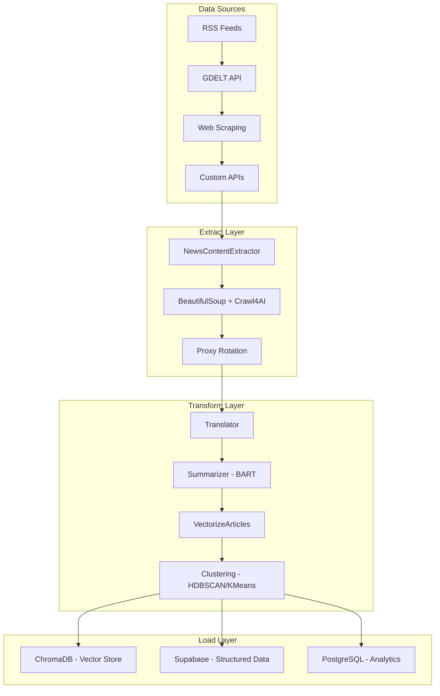
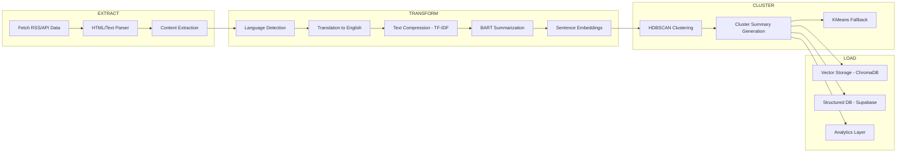

# 🧠 MASX AI News ETL Pipeline

> **Enterprise-Grade NLP ETL System with Multi-Model Hugging Face Integration**

`MASX AI News ETL` is a production-ready, modular ETL pipeline that ingests, processes, and analyzes global news content using state-of-the-art Hugging Face models. Built for real-time geopolitical intelligence and strategic forecasting, it leverages advanced NLP techniques including summarization, translation, clustering, and vector embeddings.

## 🚀 Key Features

### **🤖 Multi-Model Hugging Face Integration**
- **BART Summarization** (`facebook/bart-large-cnn`) - High-quality article summarization
- **Sentence Transformers** (`sentence-transformers/all-MiniLM-L6-v2`) - Semantic embeddings
- **NLLB Translation** - Multilingual content processing
- **Dynamic Model Loading** - Singleton-based model management with GPU/CPU optimization

### **🏗️ Modular ETL Architecture**
- **Extract**: Multi-source news ingestion (RSS, APIs, web scraping)
- **Transform**: Parallel NLP processing with async task orchestration
- **Load**: Vector storage (ChromaDB) + structured data (Supabase/PostgreSQL)

### **⚡ High-Performance Processing**
- **Async Parallel Processing** - ThreadPoolExecutor with configurable workers
- **Smart Clustering** - HDBSCAN for noise-resistant clustering + KMeans fallback
- **Memory Optimization** - TF-IDF text compression for large articles
- **Proxy Rotation** - Redis-backed proxy management for robust scraping

### **🔧 Enterprise Features**
- **Type-Safe Configuration** - Pydantic settings with environment validation
- **Comprehensive Logging** - Structured logging with rotation and monitoring
- **Error Handling** - Retry logic, graceful degradation, and exception management
- **Scalable Architecture** - Singleton patterns, dependency injection, modular design

## 🏛️ Architecture Overview



## 🔄 Processing Flow



## 🛠️ Technology Stack

| Component | Technology | Purpose |
|-----------|------------|---------|
| **NLP Models** | Hugging Face Transformers | Summarization, embeddings, translation |
| **Vector Database** | ChromaDB | High-performance vector storage |
| **Structured DB** | Supabase/PostgreSQL | Relational data and analytics |
| **Caching** | Redis | Proxy management and session caching |
| **Web Scraping** | BeautifulSoup + Crawl4AI | Robust content extraction |
| **Configuration** | Pydantic Settings | Type-safe environment management |
| **Logging** | Structlog | Structured logging with rotation |
| **Async Processing** | ThreadPoolExecutor | Parallel task execution |

## 📦 Installation

### Prerequisites
- Python 3.11+
- Redis (for proxy management)
- PostgreSQL/Supabase (for structured data)

### Quick Start
```bash
# Clone the repository
git clone https://github.com/masx-ai/masx-ai-etl.git
cd masx-ai-etl

# Install dependencies
pip install -r requirements.txt

# Set up environment variables
cp .env.example .env
# Edit .env with your configuration

# Run the ETL pipeline
python main_etl.py
```

### Environment Configuration
```env
# Database Configuration
SUPABASE_URL=your_supabase_url
SUPABASE_ANON_KEY=your_supabase_key
SUPABASE_SERVICE_ROLE_KEY=your_service_key

# ChromaDB Configuration
CHROMA_DEV_PERSIST_DIR=./.chroma_storage
CHROMA_PROD_PERSIST_DIR=/mnt/data/chroma

# Performance Settings
MAX_WORKERS=20
REQUEST_TIMEOUT=30
RETRY_ATTEMPTS=3

# Logging
LOG_LEVEL=INFO
LOG_FORMAT=json
```

## 🚀 Usage

### Basic ETL Pipeline
```python
from etl import ETLPipeline
from singleton import ChromaClientSingleton

# Initialize and run pipeline
etl_pipeline = ETLPipeline()
etl_pipeline.run_all_etl_pipelines()
```

### Custom Configuration
```python
from config import get_settings

settings = get_settings()
print(f"Environment: {settings.environment}")
print(f"Max Workers: {settings.max_workers}")
print(f"Chroma Path: {settings.chroma_dev_persist_dir}")
```

### Vector Database Operations
```python
from nlp.vector_db_manager import VectorDBManager

# Initialize vector DB manager
vdb = VectorDBManager()

# Insert documents with embeddings
vdb.insert_documents(
    collection_name="news_articles",
    texts=["Article 1", "Article 2"],
    metadatas=[{"source": "CNN"}, {"source": "BBC"}]
)

# Query similar documents
results = vdb.query_similar(
    collection_name="news_articles",
    query_text="climate change",
    top_k=5
)
```

## 🔧 Advanced Configuration

### Model Management
The system uses singleton patterns for efficient model loading:

```python
from singleton import ModelManager

# Get pre-loaded models
summarizer_model, tokenizer, device = ModelManager.get_summarization_model()
max_tokens = ModelManager.get_summarization_model_max_tokens()
```

### Clustering Strategies
```python
from nlp.clustering_strategies import HDBSCANClusterer, KMeansClusterer

# HDBSCAN for large, noisy datasets
clusterer = HDBSCANClusterer(
    min_cluster_size=5,
    min_samples=None,
    metric="euclidean"
)

# KMeans for smaller, uniform datasets
clusterer = KMeansClusterer(n_clusters=10)
```

### Performance Optimization
```python
# Configure parallel processing
settings.max_workers = 20  # Adjust based on CPU cores
settings.request_timeout = 30
settings.retry_attempts = 3

# Memory management
settings.max_memory_usage = 0.8  # 80% memory limit
```

## 📊 Example Outputs

### ETL Pipeline Logs
```
[INFO] ETLPipeline: Running NewsContentExtractor...
[INFO] NewsContentExtractor: Extracted 150 articles from 5 sources
[INFO] Summarizer: Processing 150 articles with BART model
[INFO] VectorizeArticles: Generated embeddings for 150 articles
[INFO] ClusterSummaryGenerator: Created 8 clusters using HDBSCAN
[INFO] ETLPipeline: Time taken: 45.2 seconds
```

### Database Schema
```sql
-- Vector embeddings in ChromaDB
collection: news_embeddings
- id: UUID
- text: Article summary
- metadata: {source, date, language, cluster_id}
- embedding: [0.42, -0.13, 0.77, ...]

-- Structured data in Supabase
table: flashpoints_clusters
- flashpoint_id: TEXT
- cluster_id: INTEGER
- cluster_summary: TEXT
- article_count: INTEGER
- created_at: TIMESTAMP
```

### Sample Cluster Summary
```json
{
  "flashpoint_id": "ukraine_conflict_2025",
  "cluster_id": 3,
  "cluster_summary": "Recent developments in Eastern Ukraine show increased military activity...",
  "article_count": 23,
  "top_sources": ["Reuters", "BBC", "CNN"],
  "sentiment": "neutral",
  "key_entities": ["Ukraine", "Russia", "NATO"]
}
```

## 🔍 Monitoring & Observability

### Health Checks
```python
# Check ChromaDB connection
from singleton import ChromaClientSingleton
client = ChromaClientSingleton.get_client()
collections = client.list_collections()

# Monitor model performance
from singleton import ModelManager
model_info = ModelManager.get_model_info()
print(f"Active models: {model_info}")
```

### Logging Configuration
```python
# Structured logging with rotation
import structlog
logger = structlog.get_logger()
logger.info("ETL pipeline started", 
           articles_processed=150,
           processing_time=45.2,
           clusters_generated=8)
```

## 🚀 Scaling & Performance

### Horizontal Scaling
- **Worker Pool**: Configure `max_workers` based on CPU cores
- **Database Connections**: Adjust connection pools for Supabase/PostgreSQL
- **Memory Management**: Monitor and adjust `max_memory_usage`

### GPU Acceleration
```bash
# Install CUDA-enabled PyTorch
pip install torch==2.3.0+cu118 --find-links https://download.pytorch.org/whl/torch_stable.html

# The system automatically detects and uses GPU if available
```

### Production Deployment
```bash
# Docker deployment
docker build -t masx-ai-etl .
docker run -d --name masx-etl \
  -e SUPABASE_URL=$SUPABASE_URL \
  -e SUPABASE_ANON_KEY=$SUPABASE_ANON_KEY \
  masx-ai-etl
```

## 🤝 Contributing

We welcome contributions! Please see our [Contributing Guidelines](CONTRIBUTING.md) for details.

### Development Setup
```bash
# Install development dependencies
pip install -r requirements-dev.txt

# Run tests
python -m pytest tests/

# Code formatting
black .
isort .
```

## 📄 License

This project is proprietary software developed by [Ateet Vatan Bahmani](https://ateetai.vercel.app) as part of the [MASX AI](https://masxai.com) project.

**Copyright (c) 2025 Ateet Vatan Bahmani**  
All rights reserved. Redistribution, modification, commercial use, or publication without explicit written consent is strictly prohibited.

## 📞 Support

- **Documentation**: [MASX AI Docs](https://docs.masxai.com)
- **Issues**: [GitHub Issues](https://github.com/masx-ai/masx-ai-etl/issues)
- **Contact**: ab@masxai.com
- **Website**: [MASX AI](https://masxai.com)

---

**Built with ❤️ for strategic AI intelligence and geopolitical forecasting**
