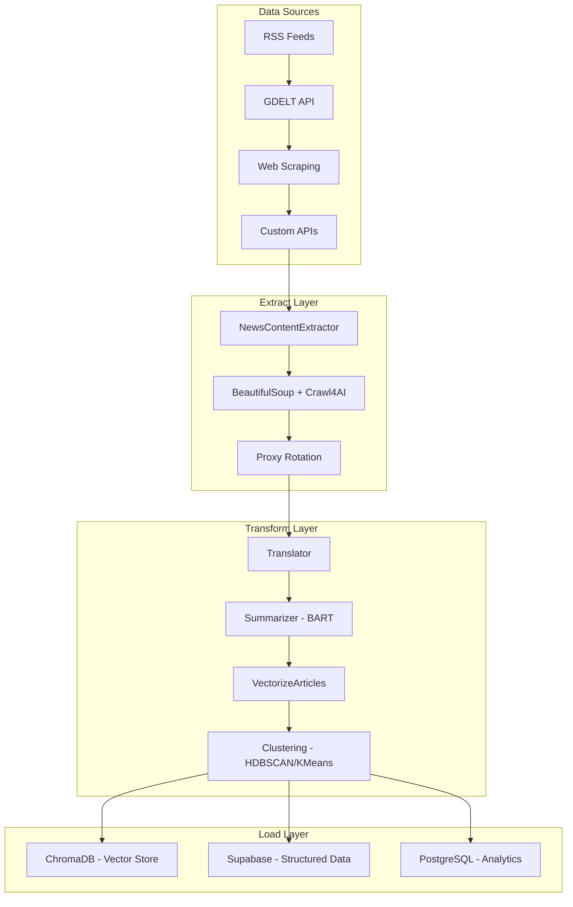
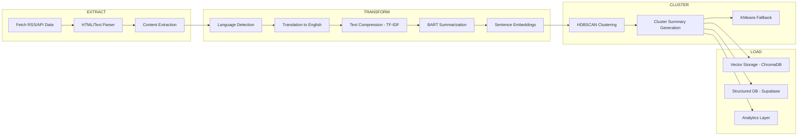

# 🧠 MASX AI News ETL Pipeline

> **Enterprise-Grade NLP ETL System with Multi-Model Hugging Face Integration**

`MASX AI News ETL` is a production-ready, modular ETL pipeline that ingests, processes, and analyzes global news content using state-of-the-art Hugging Face models. Built for real-time geopolitical intelligence and strategic forecasting, it leverages advanced NLP techniques including summarization, translation, clustering, and vector embeddings.

## 🚀 Key Features

### **🤖 Multi-Model Hugging Face Integration**
- **BART Summarization** (`facebook/bart-large-cnn`) - High-quality article summarization
- **Sentence Transformers** (`sentence-transformers/all-MiniLM-L6-v2`) - Semantic embeddings
- **NLLB Translation** - Multilingual content processing
- **Dynamic Model Loading** - Singleton-based model management with GPU/CPU optimization

### **🏗️ Modular ETL Architecture**
- **Extract**: Multi-source news ingestion (RSS, APIs, web scraping)
- **Transform**: Parallel NLP processing with async task orchestration
- **Load**: Vector storage (ChromaDB) + structured data (Supabase/PostgreSQL)

### **⚡ High-Performance Processing**
- **Modern Async Concurrency** - Unified GPU/CPU runtime with micro-batching
- **Smart Clustering** - HDBSCAN for noise-resistant clustering + KMeans fallback
- **Memory Optimization** - TF-IDF text compression for large articles
- **Proxy Rotation** - Redis-backed proxy management for robust scraping
- **Isolated Web Rendering** - Playwright workers for JavaScript-heavy sites

### **🔧 Enterprise Features**
- **Type-Safe Configuration** - Pydantic settings with environment validation
- **Comprehensive Logging** - Structured logging with rotation and monitoring
- **Error Handling** - Retry logic, graceful degradation, and exception management
- **Scalable Architecture** - Singleton patterns, dependency injection, modular design

## 🏛️ Architecture Overview



## 🚀 Concurrency Architecture

### **Modern Async-First Design**

The MASX AI ETL system uses a unified concurrency runtime that eliminates multithreading anti-patterns and provides optimal performance for both CPU and GPU workloads.

#### **Key Features:**
- **Single Source of Truth**: Centralized device detection and resource management
- **GPU Micro-Batching**: Efficient inference with configurable batch sizes and delays
- **CPU Parallelization**: Shared thread and process pools for optimal resource utilization
- **Isolated Web Rendering**: Dedicated Playwright workers to prevent event loop conflicts
- **Automatic Fallbacks**: Seamless GPU→CPU degradation with graceful error handling

#### **Environment Configuration:**
```bash
# Device selection
export MASX_FORCE_CPU=1      # Force CPU usage
export MASX_FORCE_GPU=1      # Force GPU usage

# GPU optimization
export BATCH_SIZE=32          # Items per batch
export BATCH_DELAY_MS=50      # Max wait time (ms)

# CPU optimization
export MAX_THREADS=20         # Thread pool size
export MAX_PROCS=4            # Process pool size

# Render optimization
export RENDER_MAX_PAGES=5     # Concurrent pages
export RENDER_TIMEOUT_S=30    # Page timeout
```

#### **Usage Example:**
```python
from app.core.concurrency import InferenceRuntime

# Create runtime with automatic device selection
runtime = InferenceRuntime(model_loader=load_model)
await runtime.start()

# Inference automatically routes to GPU or CPU
results = await runtime.infer_many(data_items)

await runtime.stop()
```

For detailed usage instructions, see [docs/HOWTO_CPU_GPU_STEP_BY_STEP.md](docs/HOWTO_CPU_GPU_STEP_BY_STEP.md).

## 🔄 Processing Flow



## 🛠️ Technology Stack

| Component | Technology | Purpose |
|-----------|------------|---------|
| **NLP Models** | Hugging Face Transformers | Summarization, embeddings, translation |
| **Vector Database** | ChromaDB | High-performance vector storage |
| **Structured DB** | Supabase/PostgreSQL | Relational data and analytics |
| **Web Scraping** | BeautifulSoup + Crawl4AI | Robust content extraction |
| **Configuration** | Pydantic Settings | Type-safe environment management |
| **Logging** | Structlog | Structured logging with rotation |
| **Async Processing** | Unified Concurrency Runtime | GPU micro-batching + CPU parallelization |
| **Cloud Computing** | RunPod | GPU-accelerated processing |

## 📦 Installation

### Prerequisites
- Python 3.11+
- PostgreSQL/Supabase (for structured data)
- Optional: CUDA-compatible GPU for acceleration

### New Concurrency Dependencies

The refactored system includes new dependencies for modern async concurrency:

```bash
# Core concurrency
asyncio-compat>=1.0.0
tenacity>=8.0.0

# Web rendering (if using Playwright)
playwright>=1.46.0

# Enhanced async libraries
aiohttp>=3.8.0
asyncpg>=0.27.0
aiofiles>=0.8.0
```

### Quick Start

#### 1. Clone the Repository
```bash
git clone https://github.com/masx-ai/masx-ai-etl.git
cd masx-ai-etl
```

#### 2. Choose Installation Method

**For Production (with GPU support):**
```bash
pip install -r requirements.prod.txt
```

**For Development (with testing tools):**
```bash
pip install -r requirements.dev.txt
```

**For Basic Usage:**
```bash
pip install -r requirements.txt
```

#### 3. Set Up Environment
```bash
# Copy environment template
cp env.example .env

# Edit .env with your configuration
nano .env
```

#### 4. Run the ETL Pipeline
```bash
# Run main ETL pipeline
python main_etl.py

# Or run the API server
python main.py
```

### Environment Configuration

The system uses a comprehensive configuration system. Copy `env.example` to `.env` and configure:

```env
# Core Configuration
ENVIRONMENT=development
LOG_LEVEL=INFO

# API Configuration
API_HOST=0.0.0.0
API_PORT=8000
ETL_API_KEY=your_etl_api_key_here

# Database Configuration (Supabase)
SUPABASE_URL=your_supabase_project_url
SUPABASE_ANON_KEY=your_supabase_anonymous_key
SUPABASE_SERVICE_ROLE_KEY=your_supabase_service_role_key
SUPABASE_DB_URL=your_supabase_database_url

# GDELT API Configuration
GDELT_API_KEY=your_gdelt_api_key
GDELT_API_URL=https://api.gdeltproject.org/v2/search/gkg
GDELT_API_KEYWORDS=ai,technology,innovation

# ChromaDB Configuration
CHROMA_DEV_PERSIST_DIR=./.chroma_storage
CHROMA_PROD_PERSIST_DIR=/mnt/data/chroma

# Performance Settings
MAX_WORKERS=20
REQUEST_TIMEOUT=30
RETRY_ATTEMPTS=3
```

## 🚀 Usage

### Basic ETL Pipeline

**New Async Pattern (Recommended):**
```python
import asyncio
from app.etl.etl_pipeline import ETLPipeline
from app.singleton.chroma_client_singleton import ChromaClientSingleton

async def main():
    # Initialize and run pipeline
    etl_pipeline = ETLPipeline()
    await etl_pipeline.run_all_etl_pipelines()

# Run the async pipeline
asyncio.run(main())
```

**Legacy Sync Pattern (Backward Compatible):**
```python
from app.etl.etl_pipeline import ETLPipeline
from app.singleton.chroma_client_singleton import ChromaClientSingleton

# Initialize and run pipeline
etl_pipeline = ETLPipeline()
etl_pipeline.run_all_etl_pipelines()
```

### Modern Concurrency Usage

#### **Inference Runtime (GPU/CPU Auto-Selection)**
```python
from app.core.concurrency import InferenceRuntime, RuntimeConfig

# Create runtime with automatic device selection
config = RuntimeConfig(
    gpu_batch_size=32,
    gpu_max_delay_ms=50,
    cpu_max_threads=20
)

runtime = InferenceRuntime(model_loader=load_model, config=config)
await runtime.start()

# Automatic routing to GPU or CPU
results = await runtime.infer_many(data_items)

await runtime.stop()
```

#### **CPU Executors (I/O vs CPU-Bound Work)**
```python
from app.core.concurrency.cpu_executors import run_in_thread, run_in_process

# I/O bound work (file reading, HTTP requests)
result = await run_in_thread(read_file, "data.txt")

# CPU bound work (math, data processing)
result = await run_in_process(complex_calculation, data)
```

#### **Web Rendering (Isolated Playwright Workers)**
```python
from app.infra_services.render import RenderClientContext

async with RenderClientContext() as client:
    # Render multiple pages concurrently
    responses = await client.render_pages([
        "https://example.com/1",
        "https://example.com/2"
    ])
```

### Custom Configuration
```python
from app.config.settings import get_settings

settings = get_settings()
print(f"Environment: {settings.environment}")
print(f"Max Workers: {settings.max_workers}")
print(f"Chroma Path: {settings.chroma_dev_persist_dir}")
```

### Vector Database Operations
```python
from app.nlp.vector_db_manager import VectorDBManager

# Initialize vector DB manager
vdb = VectorDBManager()

# Insert documents with embeddings
vdb.insert_documents(
    collection_name="news_articles",
    texts=["Article 1", "Article 2"],
    metadatas=[{"source": "CNN"}, {"source": "BBC"}]
)

# Query similar documents
results = vdb.query_similar(
    collection_name="news_articles",
    query_text="climate change",
    top_k=5
)
```

## 🔧 Advanced Configuration

### Model Management
The system uses singleton patterns for efficient model loading:

```python
from app.singleton.model_manager import ModelManager

# Get pre-loaded models
summarizer_model, tokenizer, device = ModelManager.get_summarization_model()
max_tokens = ModelManager.get_summarization_model_max_tokens()
```

### Clustering Strategies
```python
from app.nlp.hdbscan_clusterer import HDBSCANClusterer
from app.nlp.kmeans_clusterer import KMeansClusterer

# HDBSCAN for large, noisy datasets
clusterer = HDBSCANClusterer(
    min_cluster_size=5,
    min_samples=None,
    metric="euclidean"
)

# KMeans for smaller, uniform datasets
clusterer = KMeansClusterer(n_clusters=10)
```

### Performance Optimization
```python
# Configure parallel processing
settings.max_workers = 20  # Adjust based on CPU cores
settings.request_timeout = 30
settings.retry_attempts = 3

# Memory management
settings.max_memory_usage = 0.8  # 80% memory limit
```

## 📊 Example Outputs

### ETL Pipeline Logs
```
[INFO] ETLPipeline: Running NewsContentExtractor...
[INFO] NewsContentExtractor: Extracted 150 articles from 5 sources
[INFO] Summarizer: Processing 150 articles with BART model
[INFO] VectorizeArticles: Generated embeddings for 150 articles
[INFO] ClusterSummaryGenerator: Created 8 clusters using HDBSCAN
[INFO] ETLPipeline: Time taken: 45.2 seconds
```

### Database Schema
```sql
-- Vector embeddings in ChromaDB
collection: news_embeddings
- id: UUID
- text: Article summary
- metadata: {source, date, language, cluster_id}
- embedding: [0.42, -0.13, 0.77, ...]

-- Structured data in Supabase
table: flashpoints_clusters
- flashpoint_id: TEXT
- cluster_id: INTEGER
- cluster_summary: TEXT
- article_count: INTEGER
- created_at: TIMESTAMP
```

### Sample Cluster Summary
```json
{
  "flashpoint_id": "ukraine_conflict_2025",
  "cluster_id": 3,
  "cluster_summary": "Recent developments in Eastern Ukraine show increased military activity...",
  "article_count": 23,
  "top_sources": ["Reuters", "BBC", "CNN"],
  "sentiment": "neutral",
  "key_entities": ["Ukraine", "Russia", "NATO"]
}
```

## 🔍 Monitoring & Observability

### Health Checks
```python
# Check ChromaDB connection
from app.singleton.chroma_client_singleton import ChromaClientSingleton
client = ChromaClientSingleton.get_client()
collections = client.list_collections()

# Monitor model performance
from app.singleton.model_manager import ModelManager
model_info = ModelManager.get_model_info()
print(f"Active models: {model_info}")
```

### Logging Configuration
```python
# Structured logging with rotation
import structlog
logger = structlog.get_logger()
logger.info("ETL pipeline started", 
           articles_processed=150,
           processing_time=45.2,
           clusters_generated=8)
```

## 🚀 Scaling & Performance

### Horizontal Scaling
- **Worker Pool**: Configure `max_workers` based on CPU cores
- **Database Connections**: Adjust connection pools for Supabase/PostgreSQL
- **Memory Management**: Monitor and adjust `max_memory_usage`

### GPU Acceleration
```bash
# Production requirements include CUDA 12.1 support
pip install -r requirements.prod.txt

# The system automatically detects and uses GPU if available
# GPU dependencies: cupy-cuda12x, cuml-cu12, rmm-cu12
```

### Production Deployment
```bash
# Docker deployment
docker build -t masx-ai-etl .
docker run -d --name masx-etl \
  -e SUPABASE_URL=$SUPABASE_URL \
  -e SUPABASE_ANON_KEY=$SUPABASE_ANON_KEY \
  masx-ai-etl

# Or use GPU-enabled Docker
docker-compose -f docker-compose.gpu.yml up -d
```

## 🧪 Development & Testing

### Development Setup
```bash
# Install development dependencies (includes testing tools)
pip install -r requirements.dev.txt

# Run tests
python -m pytest tests/

# Code formatting
black .
isort .

# Pre-commit hooks
pre-commit install
```

### Testing Framework
The development requirements include comprehensive testing tools:
- **pytest** - Core testing framework
- **pytest-asyncio** - Async testing support
- **pytest-cov** - Coverage reporting
- **pytest-mock** - Mocking utilities

### Code Quality
- **black** - Code formatting
- **flake8** - Linting
- **isort** - Import sorting
- **mypy** - Type checking

## 📁 Project Structure

```
masx-ai-etl/
├── app/                          # Main application code
│   ├── api/                     # FastAPI endpoints
│   ├── config/                  # Configuration management
│   ├── core/                    # Core exceptions and utilities
│   ├── db/                      # Database operations
│   ├── etl/                     # ETL pipeline components
│   ├── nlp/                     # NLP processing modules
│   ├── schemas/                 # Pydantic data models
│   ├── singleton/               # Singleton managers
│   └── web_scrapers/            # Web scraping utilities
├── requirements.txt              # Base dependencies
├── requirements.prod.txt         # Production dependencies (GPU)
├── requirements.dev.txt          # Development dependencies
├── env.example                  # Environment configuration template
├── main.py                      # API server entry point
└── main_etl.py                  # ETL pipeline entry point
```

## 🤝 Contributing

We welcome contributions! Please see our [Contributing Guidelines](CONTRIBUTING.md) for details.

### Development Workflow
1. Fork the repository
2. Create a feature branch
3. Install development dependencies: `pip install -r requirements.dev.txt`
4. Make your changes
5. Run tests: `python -m pytest tests/`
6. Format code: `black . && isort .`
7. Submit a pull request

## 📄 License

This project is proprietary software developed by [Ateet Vatan Bahmani](https://ateetai.vercel.app) as part of the [MASX AI](https://masxai.com) project.

**Copyright (c) 2025 Ateet Vatan Bahmani**  
All rights reserved. Redistribution, modification, commercial use, or publication without explicit written consent is strictly prohibited.

## 📞 Support

- **Documentation**: [MASX AI Docs](https://docs.masxai.com)
- **Issues**: [GitHub Issues](https://github.com/masx-ai/masx-ai-etl/issues)
- **Contact**: ab@masxai.com
- **Website**: [MASX AI](https://masxai.com)

---

**Built with ❤️ for strategic AI intelligence and geopolitical forecasting**
